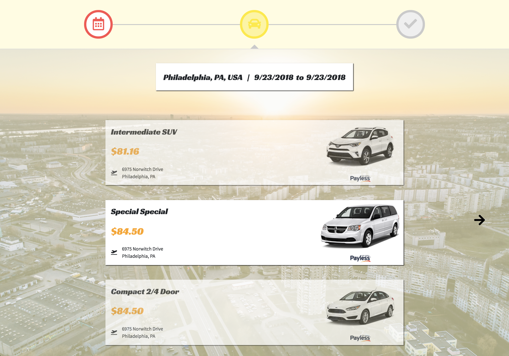

# Vroom

[Vroom](https://vroom.crystalprism.io) is a [React](https://reactjs.org/) web app that makes renting a car quick and easy. Vroom displays an interactive portal where you can search for a location and dates/times to pick up and drop off your rental car, then select a rental car from different rental companies, and lastly confirm your booking and see a map of how to get to your intended pick-up location. Vroom uses [React Geosuggest](https://github.com/ubilabs/react-geosuggest) to suggest Google Maps locations as you search for your pick-up and drop-off cities, as well as [react-day-picker](https://daypicker.dev/) to provide a calendar-based date range selector. Car rental data is acquired via [RapidAPI's Car Rental API](https://rapidapi.com/DataCrawler/api/booking-com15). When you confirm your booking, your information gets sent to a [RESTful API](https://github.com/estherh5/vroom_api) that stores your data in a PostgreSQL database and returns a unique confirmation code for your booking.

The app is built with [Vite](https://vite.dev/) and [TypeScript](https://www.typescriptlang.org/).

## Setup
1. Clone this repository locally or on your server (`git clone https://github.com/estherh5/vroom`).
2. Enter the `vroom` directory, and install the required dependencies by running `npm install`.
3. Request API keys from [RapidAPI](https://rapidapi.com/DataCrawler/api/booking-com15) and [Google Maps](https://cloud.google.com/maps-platform/#get-started).
4. Set the following environment variables in the `.env` file:
    * `VITE_GOOGLE_KEY` for the Google Maps API key you generated in step 3
    * `VITE_RAPIDAPI_KEY` for the RapidAPI API key you generated in step 3
    * `VITE_SERVER_PATH` for the URL of the back-end server that stores booking information (see the [Vroom API](https://github.com/estherh5/vroom_api) repository for setup instructions)
5. Start a development server with hot reloading by running `npm run dev`. To create an optimized production build, run `npm run build`; the compiled files will be located in the `dist` directory (preview it with `npm run preview`).

## Scripts
* `npm run dev` — start the Vite development server
* `npm run build` — type-check and build for production
* `npm run preview` — preview the production build locally
* `npm run lint` — run ESLint
* `npm test` — run the Vitest test suite
